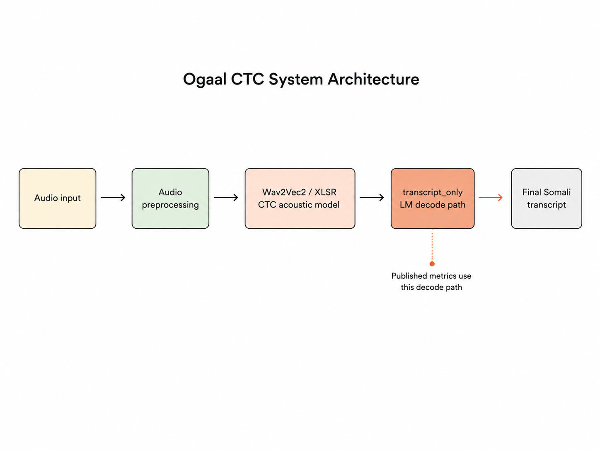

# Ogaal CTC



`Ogaal CTC` is the public Somali CTC ASR release from Ogaal Labs.

Hugging Face model: `https://huggingface.co/Ogaal-Labs/Ogaal-CTC`

## Overview

This repository packages:

- a local Somali ASR inference CLI
- a browser demo for recording or uploading audio
- the published LM-decoded usage path
- product documentation for developers

## Highlights

- Somali CTC ASR system built around `Wav2Vec2/XLSR`
- trained on roughly `72.1` hours of Somali speech
- published decode path based on `transcript_only`
- local CLI workflow for file and folder transcription
- local browser demo for recording or uploading audio

## Why Ogaal CTC Was Built

Ogaal Labs builds local datasets and practical AI tools for Somali and African communities. `Ogaal CTC` was intentionally trained and released for Somali speech recognition.

English was not part of the training objective for this release.

## Data Overview

The training effort behind this release totals roughly `72.1` hours of Somali speech.

A private Ogaal Labs collection pipeline contributed a core part of that effort through roughly `5,000` curated prompts recorded by `19` speakers across varied genders, accents, and speaking styles.

## Runtime Requirements

- Python `3.10+`
- `ffmpeg` available on the system path
- local model files placed in `model/` or passed through `--model-dir`

## Quick Start

Install dependencies:

```bash
pip install -r requirements.txt
```

Download the Hugging Face model repo into `model/` yourself or pass `--model-dir` explicitly:

```bash
git clone https://huggingface.co/Ogaal-Labs/Ogaal-CTC model
```

CLI example:

```bash
python scripts/infer_ogaal_ctc.py \
  --audio-path /path/to/audio.wav \
  --model-dir /path/to/model_repo
```

Browser demo:

```bash
python scripts/web_demo.py --host 127.0.0.1 --port 7861 --model-dir /path/to/model_repo
```

Common developer commands:

```bash
make check
make demo MODEL_DIR=/path/to/model_repo
make infer MODEL_DIR=/path/to/model_repo AUDIO=/path/to/audio.wav
```

## Somali Metrics

- validation WER with the published decode path: `0.2179`
- test WER with the published decode path: `0.2114`
- test CER with the published decode path: `0.0997`

## Decoder Note

- the published decoder path is `transcript_only`
- the release package is ready for local use through the CLI and browser demo
- the same decode path is used for the public metrics

## Repository Layout

```text
Ogaal-CTC/
├── docs/
│   ├── figures/
│   ├── MODEL_SCOPE.md
│   ├── PUBLICATION_CHECKLIST.md
│   ├── README.md
│   └── TECHNICAL_BOOK.md
├── examples/
├── metadata/
├── scripts/
├── .github/
├── CHANGELOG.md
├── CONTRIBUTING.md
├── Makefile
├── PUSHING.md
└── requirements.txt
```

## Ogaal Labs

- organization: `Ogaal Labs`
- website: `https://ogaallabs.com/`
- Hugging Face: `https://huggingface.co/Ogaal-Labs/Ogaal-CTC`

## Documentation

- technical book: `docs/TECHNICAL_BOOK.md`
- model scope: `docs/MODEL_SCOPE.md`
- publication checklist: `docs/PUBLICATION_CHECKLIST.md`
- documentation index: `docs/README.md`

## Development

- run `make check` before pushing
- keep model weights and decoder binaries out of Git
- keep local inference outputs untracked
