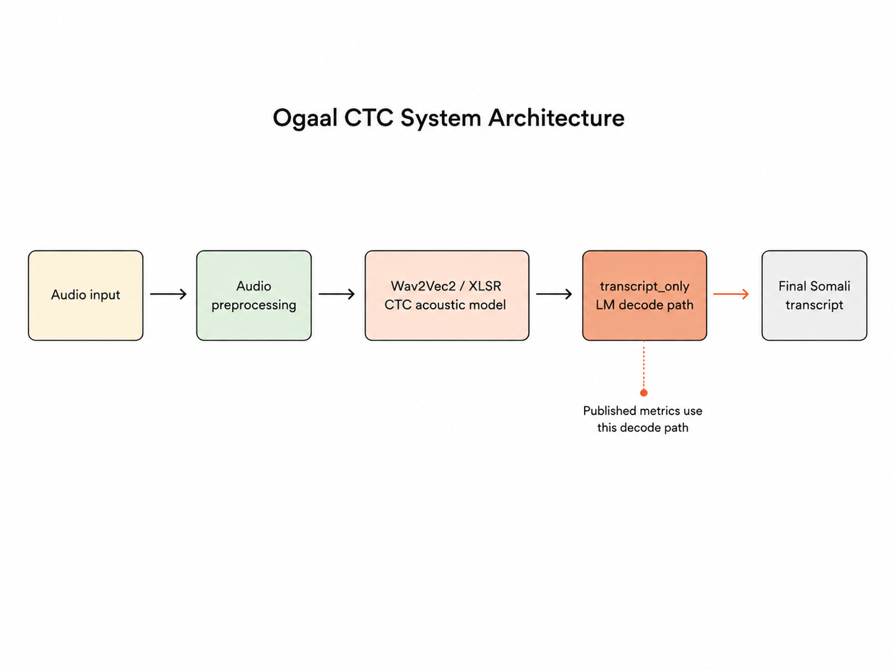

# Ogaal CTC



**Ogaal CTC** is a compact, developer-focused Somali automatic speech recognition system from Ogaal Labs. It combines a 300M-parameter Wav2Vec2/XLSR CTC acoustic model with the published `transcript_only` language-model decoder for practical local transcription.

**Model:** [Ogaal-Labs/Ogaal-CTC](https://huggingface.co/Ogaal-Labs/Ogaal-CTC)

## Key capabilities

- local CPU or GPU inference
- individual file and folder transcription
- long-audio chunking with speech-region detection
- text, JSON, JSONL, and CSV outputs
- browser demo for recording or uploading audio
- bundled decoder matching the published evaluation path

## Published Somali results

The bundled `transcript_only` decoder produced:

- validation WER: `0.2179`
- test WER: `0.2114`
- test CER: `0.0997`

> These metrics are for the bundled language-model decoder, not raw greedy CTC decoding.

## Training overview

- model family: `Wav2Vec2 / XLSR-300M`
- architecture: `Wav2Vec2ForCTC`
- training clips: `39,604`
- training audio: approximately `72.1` hours
- primary language: Somali (`so`)

A private Ogaal Labs collection contributed roughly 5,000 curated prompts recorded by 19 speakers across varied genders, accents, and speaking styles. English was not part of the training objective.

## Runtime requirements

- Python `3.10+`
- `ffmpeg` on the system path
- local model files downloaded from Hugging Face

## Quick start

```bash
git clone https://github.com/Ogaal-Labs/Ogaal-CTC.git
cd Ogaal-CTC
python -m venv .venv
source .venv/bin/activate
pip install -r requirements.txt
git clone https://huggingface.co/Ogaal-Labs/Ogaal-CTC model
```

Transcribe one file with the published decoder:

```bash
python scripts/infer_ogaal_ctc.py \
  --audio-path /path/to/audio.wav \
  --model-dir model
```

Transcribe a folder:

```bash
python scripts/infer_ogaal_ctc.py \
  --audio-dir /path/to/audio_folder \
  --model-dir model \
  --recursive
```

Run the local browser demo:

```bash
python scripts/web_demo.py \
  --host 127.0.0.1 \
  --port 7861 \
  --model-dir model
```

## Transformers acoustic-model usage

```python
from transformers import AutoModelForCTC, AutoProcessor

model_id = "Ogaal-Labs/Ogaal-CTC"
processor = AutoProcessor.from_pretrained(model_id)
model = AutoModelForCTC.from_pretrained(model_id)
```

This loads the acoustic model for raw or greedy CTC decoding. Use the repository CLI and bundled `transcript_only` decoder to reproduce the published WER and CER.

## Intended use

- Somali speech transcription
- local and privacy-sensitive transcription workflows
- developer integration for Somali voice products
- research and evaluation using the released decode path

## Limitations

- designed for Somali, not general multilingual transcription
- English was not part of the training objective
- accuracy may vary with accents, noise, microphones, domains, and speaking styles
- confidence values are experimental and should not be treated as calibrated probabilities

## Documentation

- [Technical book](docs/TECHNICAL_BOOK.md)
- [Model scope](docs/MODEL_SCOPE.md)
- [Contributing](CONTRIBUTING.md)
- [Hugging Face model card](https://huggingface.co/Ogaal-Labs/Ogaal-CTC)

## License

The code in this repository is licensed under the [Apache License 2.0](LICENSE). The published model repository uses the same license.

## Ogaal Labs

Ogaal Labs builds local datasets and practical AI tools for Somali and African communities.

- Website: https://ogaallabs.com/
- Hugging Face: https://huggingface.co/Ogaal-Labs/Ogaal-CTC
